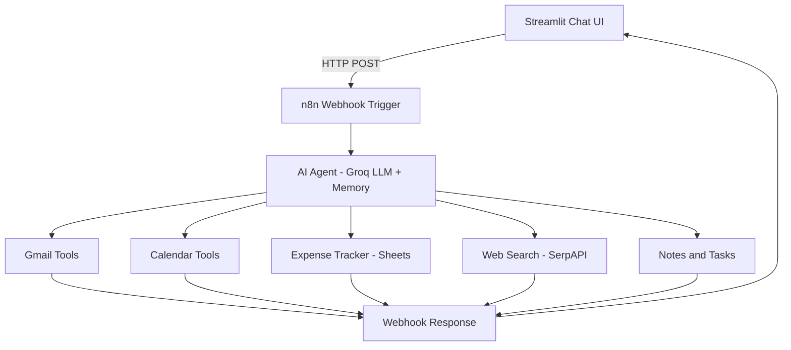

# Personal n8n AI Assistant

A personal AI assistant powered by n8n agentic workflows, Groq LLM, and a Streamlit chat interface — built to manage real-life productivity tasks through natural language.

> ⚠️ This is a personal project. The live deployment is private as it connects to personal Gmail, Calendar, and Google Sheets.

---

## ✨ Features

- 📧 **Gmail** — read, search, and send emails through natural language
- 📅 **Calendar** — view upcoming events and create new ones
- 💰 **Expenses** — log and retrieve expenses stored in Google Sheets
- 🔍 **Web Search** — real-time web search via SerpAPI
- 📝 **Notes & Tasks** — create and manage notes and task lists

---

## 🧠 Architecture



## 🛠️ Tech Stack

| Layer | Technology |
|---|---|
| Chat UI | Streamlit |
| Workflow Orchestration | n8n (cloud) |
| LLM Inference | Groq |
| Memory | n8n Simple Memory |
| Gmail Integration | n8n Gmail nodes |
| Calendar Integration | n8n Google Calendar nodes |
| Expense Storage | Google Sheets via n8n |
| Web Search | SerpAPI via n8n |
| Trigger | n8n Webhook |

---

## ⚙️ Local Setup

### 1. Clone the repository
```bash
git clone https://github.com/Abhishek-roy-221/personal-ai-assistant.git
cd personal-ai-assistant
```

### 2. Install dependencies
```bash
pip install -r requirements.txt
```

### 3. Create `.env` file

WEBHOOK_URL=your_n8n_webhook_url_here


### 4. Run the app
```bash
streamlit run app.py
```

---

## 🔒 Security Note

Webhook URL and all Google credentials are stored as environment variables and never committed to the repository. This project connects to personal accounts so the live deployment is kept private.

---

## 👨‍💻 Author

**Abhishek Roy** — Final-year ECE @ NSEC Kolkata

[LinkedIn](https://www.linkedin.com/in/abhishek-roy-5baab0281/) · [GitHub](https://github.com/Abhishek-roy-221) · [LeetCode](https://leetcode.com/u/AbhishekRoy221/)
